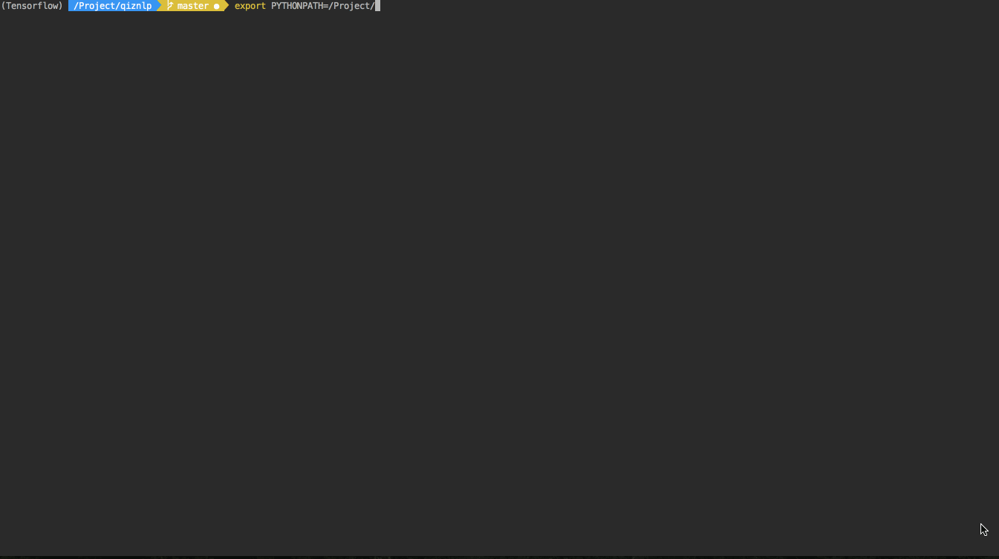
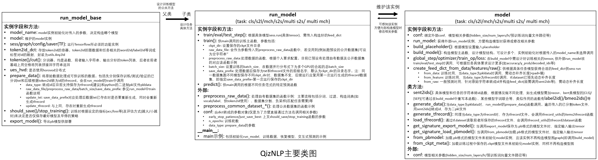

[](https://pypi.org/project/QizNLP/)

  


  

如对您有帮助，欢迎star本项目~~感谢！  
[文章系列](https://www.zhihu.com/column/c_1310303923157647360)  
##### 一键运行分类 Demo  (用cpu演示所以训练较慢) 


##### 任务/模型支持概览

|任务|支持模型<br>(*表示默认)|相关代码<br>(训练/模型)|默认数据|数据文件|来源| 
|:------:|:---:|:---|---|:---|---|
|分类|TransEncoder+MeanPooling<br>*TransEncoder+MHAttPooling<br>BERT|run_cls.py<br>model_cls.py|头条新闻分类|train/valid/test.toutiao.cls.txt|https://github.com/luopeixiang/textclf|
|序列标注|*BiLSTM+CRF<br>IDCNN+CRF<br>BERT+CRF|run_s2l.py<br>model_s2l.py|ResumeNER简历数据|train/dev/test.char.bmes.txt|https://github.com/jiesutd/LatticeLSTM|
|匹配|*ESIM|run_mch.py<br>model_mch.py|ChineseSTS相似语义文本|mch_example_data.txt|https://github.com/IAdmireu/ChineseSTS|
|生成|LSTM_Seq2Seq+Attn<br>*Transformer|run_s2s.py<br>model_s2s.py|小黄鸡闲聊5万|XHJ_5w.txt|https://github.com/candlewill/Dialog_Corpus|
||
|多轮匹配|DAM<br>*MRFN|run_multi_mch.py<br>multi_mch_model.py|豆瓣多轮会话600+|Douban_Sess662.txt|https://github.com/MarkWuNLP/MultiTurnResponseSelection
|多轮生成|HRED<br>HRAN<br>*ReCoSa|run_multi_s2s.py<br>multi_s2s_model.py|小黄鸡闲聊5万<br>豆瓣多轮会话600+|XHJ_5w.txt<br>+Douban_Sess662.txt|https://github.com/candlewill/Dialog_Corpus<br>https://github.com/MarkWuNLP/MultiTurnResponseSelection

##### 目录
* [QizNLP简介](#QizNLP简介)
* [安装流程](#安装流程)
* [使用示例](#使用示例)
   * [快速运行（使用默认数据训练）](#1快速运行使用默认数据训练)
   * [使用自有数据](#2使用自有数据)
   * [加载预训练模型](#3加载预训练模型)
* [框架设计思路](#框架设计思路)
* [公共模块](#公共模块)
* [修改适配需关注点](#修改适配需关注点)
   * [生成词表字典](#1生成词表字典)
   * [数据处理相关](#2数据处理相关)
   * [run和model的conf参数](#3run和model的conf参数)
   * [使用分布式](#4使用分布式)
* [类图](#类图)
* [TODO](#todo)
* [参考](#参考)
* [后记](#后记)


## QizNLP简介
QizNLP（Quick NLP）是一个面向NLP四大常见范式（分类、序列标注、匹配、生成），提供基本全流程（数据处理、模型训练、部署推断），基于TensorFlow的一套NLP框架。 
 
设计动机是为了在各场景下(实验/比赛/工作)，可快速灌入数据到模型，验证效果。从而在原型试验阶段可更快地了解到数据特点、学习难度及对比不同模型。 
 
QizNLP的特点如下：

* 封装了训练数据处理函数(TFRecord或Python原生数据两种方式）及词表生成函数。
* 针对分类、序列标注、匹配、生成这四种NLP任务提供了使用该框架进行模型训练的参考代码，可一键运行（提供了默认数据及默认模型）
* 封装了模型导出装载等函数，用以支持推断部署。提供部署参考代码。
* 封装了少量常用模型。封装了多种常用的TF神经网络操作函数。
* 封装了并提供了分布式训练方式（利用horovod）

设计原则：

框架设计并非追求面面俱到，因为每个人在实践过程中需求是不一样的（如特殊的输入数据处理、特殊的训练评估打印保存等过程）。故框架仅是尽量将可复用功能封装为公共模块，然后为四大范式（分类/序列标注/匹配/生成）提供一个简单的训练使用示例，供使用者根据自己的情况进行参考修改。框架原则上是重在灵活性，故不可避免地牺牲了部分易用性。虽然这可能给零基础的初学者带来一定困难，但框架的设计初衷也是希望能作为NLP不同实践场景中的一个编码起点（相当于初始弹药库），并且能在个人需求不断变化时也能灵活进行适配及持续使用。
  
## 安装流程
项目依赖
```
python>=3.6
1.8<=tensorflow<=1.14
```
已发布pypi包，可直接通过```pip```安装(推荐)
```shell script
pip install QizNLP
```
或通过本项目github安装
```shell script
pip install git+https://github.com/Qznan/QizNLP.git
```
安装完毕后，进入到你自己创建的工作目录，输入以下命令：
```shell script
qiznlp_init
```
回车后，会在当前工作目录生成主要文件：
```bash
.
├── model	# 各个任务的模型代码示例
│   ├── cls_model.py
│   ├── mch_model.py
│   ├── s2l_model.py
│   ├── s2s_model.py
│   ├── multi_mch_model.py
│   └── multi_s2s_model.py
├── run		# 各个任务的模型训练代码示例
│   ├── run_cls.py
│   ├── run_mch.py
│   ├── run_s2l.py
│   ├── run_s2s.py
│   ├── run_multi_mch.py
│   └── run_multi_s2s.py
├── deploy	# 模型载入及部署的代码示例
│   ├── example.py
│   └── web_API.py
├── data	# 各个任务的默认数据
│   ├── train.toutiao.cls.txt
│   ├── valid.toutiao.cls.txt
│   ├── test.toutiao.cls.txt
│   ├── train.char.bmes.txt
│   ├── dev.char.bmes.txt
│   ├── test.char.bmes.txt
│   ├── mch_example_data.txt
│   ├── XHJ_5w.txt
│   └── Douban_Sess662.txt
└── common	# 存放预训练bert模型等
    └── modules
        └── bert
            └── chinese_L-12_H-768_A-12
```
注意：如果不是通过pip安装此项目而是直接从github上克隆项目源码，则进行后续操作前需将包显式加入python路径中：
```
# Linux & Mac
export PYTHONPATH=$PYTHONPATH:<克隆的qiznlp所在dir>
# Windows
set PYTHONPATH=<克隆的qiznlp所在dir>
```
## 使用示例
#### 1.快速运行（使用默认数据训练）
```shell script
cd run

# 运行分类任务
python run_cls.py

# 运行序列标注任务
python run_s2l.py

# 运行匹配任务
python run_mch.py

# 运行生成任务
python run_s2s.py

# 运行多轮匹配任务
python run_multi_mch.py

# 运行多轮生成任务
python run_multi_s2s.py

```
各任务默认数据及模型说明
[见上](#任务模型支持概览)

#### 2.使用自有数据
根据输入数据文本格式修改```run_*.py```中的```preprocess_raw_data()```函数，决定如何读取自有数据。
各```run_*.py```中，均已有```preprocess_raw_data()```的函数参考示例，其中默认文本格式如下：
* ```run_cls.py```：默认输入文本格式的每行为：```句子\t类别``` 
    > 自然语言难处理\t科技类
* ```run_s2l.py```：默认输入文本格式的每行为：```句子(以空格分好)\t标签(以空格分好)```
    > 我 是 王 五 ， 没 有 人 比 我 更 懂 N L P 。\tO O B-NAME I-NAME O O O O O O O O B-TECH I-TECH I-TECH O
* ```run_mch.py```：默认输入文本格式的每行为：```句子1\t句子2```(正样本对，框架自行负采样)  
    > 自然语言难处理\t自然语言处理难
* ```run_s2s.py```：默认输入文本格式的每行为：```句子1\t句子2```  
    > 自然语言难处理\t机器也不学习
* ```run_multi_mch.py```：默认输入文本格式的每行为：```多轮对话句子1\t多轮对话句子2\t...\t多轮对话句子n```
    > 自然语言难处理\t机器也不学习\t还说是人工智能\t简直就是人工智障\t大佬所见略同\t握手
* ```run_multi_s2s.py```：默认输入文本格式的每行为：```多轮对话句子1\t多轮对话句子2\t...\t多轮对话句子n```
    > 自然语言难处理\t机器也不学习\t还说是人工智能\t简直就是人工智障\t大佬所见略同\t握手

然后在```run_*.py```中指定```train()```的数据处理函数为```preprocess_raw_data```，以```run_cls.py```为例：
```python
# 参数分别为：模型ckpt保存路径、自有数据文件路径、数据处理函数、训练batch size
rm_cls.train('cls_ckpt_1', '../data/cls_example_data.txt', preprocess_raw_data=preprocess_raw_data, batch_size=512)

# 注意：如果数据集不变的情况修改了模型想继续实验(这应该是调模型的大部分情况),在设置ckpt保存路径为'cls_ckpt_2'后，可设置参数
# save_data_prefix='cls_ckpt_1'。表示使用前一次实验处理的已有数据，以节省时间。如下：
# 修改了模型后的再次实验：
rm_cls.train('cls_ckpt_2', '../data/cls_example_data.txt', preprocess_raw_data=preprocess_raw_data, batch_size=512, save_data_prefix='cls_ckpt_1')
```
具体更多细节可自行查阅代码，相信你能很快理解并根据自己的需求进行修改以适配自有数据 :)

这里有个彩蛋：第一次运行自有数据会不成功，需要对应修改```model_*.py```中conf与字典大小相关的参数，详情请参考下文：字典生成中的[提醒](#1生成词表字典)

#### 3.加载预训练模型

默认使用了谷歌官方中文bert-base预训练模型，[下载](https://storage.googleapis.com/bert_models/2018_11_03/chinese_L-12_H-768_A-12.zip) 并将对应模型文件放入当前工作目录的以下文件中：
```bash
common/modules/bert/chinese_L-12_H-768_A-12
                        ├── bert_model.ckpt.data-00000-of-00001  # 自行下载
                        ├── bert_model.ckpt.index # 自行下载
                        ├── bert_model.ckpt.meta  # 自行下载
                        ├── bert_config.json  # 框架已提供
                        └── vocab.txt  # 框架已提供
```
model中则是通过该路径构造bert模型，以cls_model.py中的bert类模型为例：
```python
bert_model_dir = f'{curr_dir}/../common/modules/bert/chinese_L-12_H-768_A-12'
```

### 框架设计思路
——只有大体了解了框架设计才能更自由地进行适配 :)

一个NLP任务可以分为：数据选取及处理、模型输入输出设计、模型结构设计、训练及评估、推断、部署。
由此抽象出一些代码模块：
* run模块负责维护以下实例对象及方法：
	* TF中的sess/graph/config/saver
	* 分词方式、字典实例
	* 分布式训练（hvd）相关设置
	* 一个model实例
	* 模型的保存与恢复方法
	* 训练、评估方法
	* 基本的推断方法
	* 原始数据处理方法（数据集切分、分词、构造字典）


* model模块负责维护：
	* 输入输出设计
	* 模型结构设计
	* 输入输出签名暴露的接口
	* 从pb/meta恢复模型结构方法
	
model之间的主要区别是维护了自己特有的输入输出（即tf.placeholder的设计），故有以下实践建议：

**何时不需要新建model？**  
原则上只要输入输出不变，只有模型结构改变，则直接在原有model中增加新模型代码并在初始化时选择新的模型结构。  
这种情况经常出现在针对某个任务的结构微调及试错过程中。

**何时需要新建model？**  
当输入输出有调整。  
例如想额外考虑词性特征，输入中要加入词性信息字段。或者要解决一个全新的任务。

**model与run的关系？**  
一般一个model对应一个专有run。新建model后则应新建一个相应run。  
原因主要考虑到run的训练评估过程需要与model的输入输出对齐。同时，model的不同输入可能也依赖于run进行特别的数据处理（如分词还是分字，词表大小，unk特殊规则等）

**model与run有哪些数据交互？**  
不同任务的主要区别包括如何对文本进行向量化（即token转id），需要设计分词、字典、如何生成向量、如何对齐到网络的placeholder。  
这里让model负责该向量化方法，run会将自己的分词、字典传过去。并且该向量化方法会被其它许多地方调用。举例：
* 生成向量方式会被应用于run的数据处理（生成tfrecord或原生py的pkl数据），以及对原始数据进行推断时的预处理
* 生成向量后对齐到placeholder的方式则会被应用在run的训练及推断。

**为何使用bert类模型时输入改变了但不必新增model与run？**  
bert类模型的输入有额外的\[CLS]\\\[SEP]等特殊符号，但本质上是模型层面的输入适配而不是任务数据层面的改变，故直接在原有model中重写与输入有关的函数，包装一层处理成bert输入的方法即可。

### 公共模块
qiznlp包的公共模块文件如下：  
（因为是基本不需更改的基础模块，故没有在```qiznlp_init```命令初始化随其他文件一起复制到当前目录， 通过```qiznlp.common.*```调用）
```bash
└── common
    ├── modules  # 封装少量常用模型及各种TF的神经网络常用操作函数。
    ├── tfrecord_utils.py  # 封装TFRecord数据保存及读取操作。
    ├── train_helper.py  # 封装train过程中对数据的处理及其它相关方法。
    └── utils.py  # 基础类，个人对python中一些数据IO的简单封装，框架的许多IO操作调用了里面封装的方法，建议详细看看。
```

### 修改适配需关注点
##### 1、生成词表字典
```utils.Any2id```类封装了字典相关的功能,可通过传入文件进行初始化，在run中示例如下
```python
token2id_dct = {
	'word2id': utils.Any2Id.from_file(f'{curr_dir}/../data/toutiaoword2id.dct', use_line_no=True),
	}
# use_line_no参数表示直接使用字典文件中的行号作为id
```
如果传入的字典文件为空，则需要在run的数据处理函数中进行字典的构建，并保存到文件，方便下次直接读取
```python
# 在迭代处理数据时循环调用
token2id_dct['word2id'].to_count(cuted_sentent.split(' '))  # 迭代统计token信息，句子已分词，空格分隔
# 结束迭代后构造字典
# 参数包括 预留词、最小词频、最大词表大小
token2id_dct['word2id'].rebuild_by_counter(restrict=['<pad>', '<unk>'], min_freq=1, max_vocab_size=20000)
token2id_dct['word2id'].save(f'{curr_dir}/../data/toutiaoword2id.dct')  # 保存到文件
```
**注意-1**: 在某个任务切换跑自有数据与公共数据集时，记得切换token2id_dct的字典文件名，如下：
```python
self.token2id_dct = {
    # 'word2id': utils.Any2Id.from_file(f'{curr_dir}/../data/cls_word2id.dct', use_line_no=True),  # 自有数据
    # 'label2id': utils.Any2Id.from_file(f'{curr_dir}/../data/cls_label2id.dct', use_line_no=True),  # 自有数据
    'word2id': utils.Any2Id.from_file(f'{curr_dir}/../data/toutiao_cls_word2id.dct', use_line_no=True),  # toutiao新闻
    'label2id': utils.Any2Id.from_file(f'{curr_dir}/../data/toutiao_cls_label2id.dct', use_line_no=True),  # toutiao新闻
    }
```
**注意-2**: 对自有数据进行训练时，由于模型的初始化比训练数据的处理更早，所以model源码中conf的相关参数（如：vocab size/label size等）只能先随意指定。之后等对训练数据的处理（分词、构造字典）完毕后才确认这些参数。  
目前解决方式是运行两次run：第一次运行构造字典完毕后，会检查字典大小与model源码的vocab size等相关参数是否一致，不一致则自动更新model源码，请根据提示再次运行即可。如下：
```bash
some param should be update:
vocab_size => param: 40000 != dict: 4500
update vocab_size success
script will exit! please run the script again! e.g. python run_***.py
```
（当然也可以使用自己预定义的字典文件，然后在model源码conf中设置正确的相关参数后直接运行run）

##### 2、数据处理相关
```preprocess_raw_data```返回训练、验证、测试数据的元组：
```
def preprocess_raw_data():
    # ...
    return train_items, dev_items, test_items  # 分别对应训练/验证/测试

    # 其中验证和测试可为None，此时模型将不进行相应验证或测试，如： 
    # return train_items, dev_items, None  # 不进行测试
```

##### 3、run和model的conf参数
run中的conf示例如下：
```
# run_cls.py
conf = utils.dict2obj({
    'early_stop_patience': None,  # 根据指标是否早停
    'just_save_best': True,  # 仅保存指标最好的模型（减少磁盘空间占用）
    'n_epochs': 20,  # 训练轮数
    'data_type': 'tfrecord',  # 训练数据处理成TFRecord
    # 'data_type': 'pkldata',  # 训练数据处理成py原生数据
})
# 前两者的具体指标通过修改train时相关方法的参数确定
```
model中conf示例如下：
```
# model_cls.py
conf = utils.dict2obj({
    'vocab_size'"': 14180,  # 词表大小，也就是上文所述构建字典后需注意对齐的参数
    'label_size': 16,  # 类别数量，需注意对齐
    'embed_size': 300,
    'hidden_size': 300,
    'num_heads': 6,
    'num_encoder_layers': 6,
    'dropout_rate': 0.2,
    'lr': 1e-3,
    'pretrain_emb': None,  # 不使用预训练词向量
    # 'pretrain_emb': np.load(f'{curr_dir}/pretrain_word_emb300.npy'),  # 使用预训练词向量(np格式)[vocab_size,embed_size]
})
```
具体参数可根据个人任务情况进行增删改。
##### 4、使用分布式
框架提供的分布式功能基于horovod（使用一种同步数据并行策略），即将batch数据分为多个小batch，分配到多机或多卡来训练。

前提：```pip install horovod```  
限制：只能用TFRecord数据格式（因为需利用其提供的分片shard功能）。但生成TFRecord的过程不方便多个worker并行,故实践建议分两次运行，第一次采用非分布式正常运行生成数据、字典并能跑通训练，第二次运行才进行分布式训练  
操作步骤：先按照正常方式运行一遍，以```run_cls.py```为例，终端运行：
```
python run_cls.py
```
其中run的初始化为：
```
rm_cls = Run_Model_Cls('trans_mhattnpool')
rm_cls.train('cls_ckpt_taskname', 'raw_data_file', preprocess_raw_data=preprocess_raw_data_fn, batch_size=batch_size)  # train
```
等通过终端日志确定已生成完TFRecord数据后，并且字典相关大小也和model对齐之后，```ctrl+c```退出  
继而修改初始化参数```use_hvd=True```：
```
rm_cls = Run_Model_Cls('trans_mhattnpool', use_hvd=True)
rm_cls.train('cls_ckpt_taskname', 'raw_data_file', preprocess_raw_data=preprocess_raw_data_fn, batch_size=batch_size)  # train
```
并在终端按照horovod要求的格式运行命令：
```
horovodrun -np 2 -H localhost:2 python run_cls.py
# -np 2 代表总的worker数量为2
# -H localhost:2 代表使用本机的2块GPU
# 注意此时需要在代码中事先设置好正确数量的可见GPU，如：os.environ['CUDA_VISIBLE_DEVICES'] = '0,1'
```
提醒：分布式训练中```train()```指定的```batch_size```参数即为有效（真实）batch size，内部会将batch切分为对应每个机或卡的小batch。故分布式训练实践中可在```train()```中直接指定较大的```batch_size```。
### 类图
附上主要的类设计图说明

## TODO
* 完善对model和run模块的单独说明
* 完善对公共module模块相关说明
* 完善对deploy模块相关说明
* 继续增加各任务默认模型(尤其预训练模型)，各任务数据集
* 继续完善框架，保持灵活性的同时尽量增加易用性
* README.md英文化
* 增加更多其他任务（如~~多轮检索和生成~~、MRC、few-shot-learning等）

## 参考
* [tensor2tensor](https://github.com/tensorflow/tensor2tensor)
* [bert](https://github.com/google-research/bert)

## License
Mozilla Public License 2.0 (MPL 2.0)

## 后记
框架形成历程：  
最早是在研究T2T官方transformer时，将transformer相关代码抽取独立出来，方便其他任务。  
之后增加了自己优化的S2S的beam_search代码（支持一些多样性方法），以及总结了TF模型的导出部署代码。  
后续在解决各种任务类型时，考虑着代码复用，不断重构，追求设计方案的灵活，最终得到现版本。
  
深知目前本项目仍有许多可改进的地方，欢迎issue和PR，也希望感兴趣的人能一起加入来改进！  
如觉得本项目有用，感谢您的star~~

